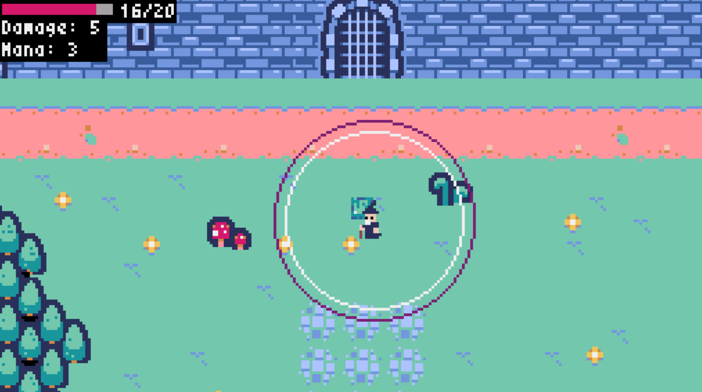

# About Me
I am a computer science student with a specific interest in applied math and computer graphics. I am preparing to transfer to a more rigorous university program to deepen my technical foundation. My ultimate goal is to engineer advanced visual effects and/or simulation technologies for the film industry.

# The Wanderer's Path

## Project Overview
"The Wanderer's Path" is a 2D top-down RPG built with Python and the Pyxel engine. 
The player can explore the map, battle enemies, and uncover hidden areas in a world
that dynamically responds to real-world weather and time.

[🎮 Play the Web Version Here!](https://yvaragon23.github.io/the-wanderers-path/)

## Key Features
* **Custom Collision Logic:** Built utilizing AABB (Axis-Aligned Bounding Box) logic for accurate sprite interaction.
* **Dynamic Weather System:** The local version integrates with the OpenWeatherMap API to pull real-world data and dynamically alter in-game conditions.
* **Browser Deployment:** Packaged into a self-contained `.html` format utilizing WebAssembly for immediate browser playability.

## Web Player
To make this project playable on the web, I had to come up with a solution for browser security restrictions. Web browsers block standard Python network libraries (like `requests`) from reaching out to external APIs like OpenWeatherMap. I refractored the game to run without the weather simulation in response. So that is unfortunately abscent from the web player, but still available on the local game.

## Source Code & Local Setup
The complete codebase for *The Wanderer's Path* is hosted in a dedicated repository to maintain a clean architecture. 

[📁 View the Source Code Repository Here](https://github.com/yvaragon23/the-wanderers-path)

To run the complete version of the game (including live weather features) on your local machine:
1. Clone the repository linked above.
2. Ensure Python 3.13 and Pyxel 2.8.2 are installed.
3. Update the `credentials.py` file in the root directory and add your OpenWeatherMap API key.
4. Feel free to also change the city in the weather instance under the 'game.py' file.
5. Run `python run.py`.
